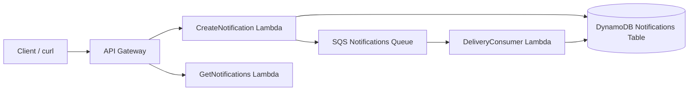

# Hogwarts Notifications Service

A small serverless notifications service built with **Node.js**, **AWS Lambda**, **API Gateway**, **DynamoDB**, and **SQS**. The service allows professors and students to send and retrieve enchanted notifications (for example: *"An owl has delivered your letter"*).

This project was implemented as a minimal but production-style architecture demonstrating clean structure, validation, testing, and asynchronous processing.

---

# Overview

The service supports two core operations:

## Create a notification
`POST /notifications`

Creates a notification, stores it in DynamoDB, and publishes a message to SQS.

## Retrieve notifications
`GET /notifications/{recipient}`

Returns notifications for a given recipient, optionally limited by query parameter.

---

# Architecture

The system uses a simple event-driven serverless design:

## API Layer

API Gateway exposes HTTP endpoints.


## Compute Layer

### CreateNotification Lambda

Validates input
Writes notification to DynamoDB
Publishes message to SQS


### GetNotifications Lambda

Queries DynamoDB by recipient


### DeliveryConsumer Lambda (bonus feature)

Consumes SQS messages
Updates notification status from `queued` → `delivered`


## Storage Layer

DynamoDB stores notification records.


## Messaging Layer

SQS decouples notification creation from delivery processing.


---

# Architecture Diagram



# Data Model

Each notification is stored as:

```json
{
  "id": "uuid-v4",
  "recipient": "Harry Potter",
  "message": "Owl: You have a letter.",
  "status": "queued",
  "createdAt": "2026-03-20T19:09:04.302Z"
}
```

---

# DynamoDB Design

Table keys:

Partition key:

```
recipient
```

Sort key:

```
createdAt
```

This design supports the required access pattern:

```
GET /notifications/{recipient}
```

and allows notifications to be sorted chronologically.

---

# Project Structure

```
hogwarts-notifications-service/

create-notification/
  app.mjs
  package.json
  tests/

get-notifications/
  app.mjs
  package.json
  tests/

delivery-consumer/
  app.mjs
  package.json

events/
template.yaml
samconfig.toml
README.md
```

---

# Deployment Instructions

## Prerequisites

You must have installed:


AWS CLI
AWS SAM CLI
Node.js 20+
An AWS account with credentials configured


Verify:

```bash
aws --version
sam --version
node --version
```

---

# Install Dependencies

Install dependencies for each Lambda:

```bash
cd create-notification
npm install

cd ../get-notifications
npm install

cd ../delivery-consumer
npm install

cd ..
```

---

# Build

Build the project:

```bash
sam build
```

---

# Deploy

First deployment:

```bash
sam deploy --guided
```

Recommended answers:

Stack name:

```
hogwarts-notifications-service
```

Region:

```
us-east-1
```

Allow IAM role creation:

```
Y
```

Save configuration:

```
Y
```

Subsequent deployments:

```bash
sam deploy
```

---

# Running the Service

After deployment, SAM outputs the API endpoint:

Example:

```
https://<api-id>.execute-api.us-east-1.amazonaws.com/Prod/notifications
```

---
# Live API (optional)

A deployed version of this service is available here:

POST:
https://9rqhbqecwd.execute-api.us-east-1.amazonaws.com/Prod/notifications

GET example:
https://9rqhbqecwd.execute-api.us-east-1.amazonaws.com/Prod/notifications/Harry%20Potter

Note: This environment may be removed after evaluation. The service can be redeployed using the instructions above.

# Example Requests

## Create a notification

```bash
curl -X POST "https://<api>/Prod/notifications" \
-H "Content-Type: application/json" \
-d '{"recipient":"Harry Potter","message":"Owl delivery"}'
```

Example response:

```json
{
  "id":"uuid",
  "recipient":"Harry Potter",
  "message":"Owl delivery",
  "status":"queued",
  "createdAt":"timestamp"
}
```

---

## Get notifications for a recipient

```bash
curl "https://<api>/Prod/notifications/Harry%20Potter"
```

Example response:

```json
[
  {
    "recipient":"Harry Potter",
    "message":"Owl delivery",
    "status":"delivered"
  }
]
```

---

## Get notifications with limit

```bash
curl "https://<api>/Prod/notifications/Harry%20Potter?limit=1"
```

---

# Running Tests

Unit tests were added to demonstrate validation logic and handler behavior.

## Run POST tests

```bash
cd create-notification
npm test
```

## Run GET tests

```bash
cd ../get-notifications
npm test
```

Tests cover:

Create notification:


valid request returns 201
invalid JSON returns 400
missing recipient returns 400
missing message returns 400


Get notifications:


valid query returns results
missing recipient returns 400
invalid limit returns 400


---

# Validation and Error Handling

The service validates:

POST:


invalid JSON body
missing recipient
missing message
blank values


GET:


missing recipient
invalid limit parameter


Infrastructure:


DynamoDB failures return 500
SQS failures return 500


---

# Bonus Features Implemented

The following optional improvements were implemented:

## Unit Tests

Basic handler tests validating success and failure scenarios.

## SQS Consumer Lambda

Background worker that:


consumes queue messages
updates notification status to delivered


## Architecture Diagram

Added to README for clarity.

---

# Design Choices and Tradeoffs

I intentionally kept the architecture simple and focused on the assignment requirements.

Design decisions:

## JavaScript vs TypeScript

JavaScript was used to minimize tooling complexity and focus on architecture and behavior. TypeScript could be added later for stronger type safety.

## DynamoDB key design

Recipient was chosen as partition key because it matches the required query pattern.

## SQS usage

SQS was used to decouple creation from delivery processing and demonstrate event-driven architecture.

## Testing scope

Tests focus on handler validation and behavior rather than full AWS integration to keep implementation concise.

---

# Improvements With More Time

If extended further I would add:


integration tests using local SAM invoke
authentication (API key or Cognito)
idempotency protection on POST
structured logging strategy
observability (CloudWatch dashboards)
tighter IAM policies
pagination support for GET


---

# Summary

This implementation demonstrates:


Serverless architecture design
Node.js Lambda development
DynamoDB data modeling
SQS event processing
Infrastructure as code
Validation and error handling
Unit testing

Environment will be removed after review.